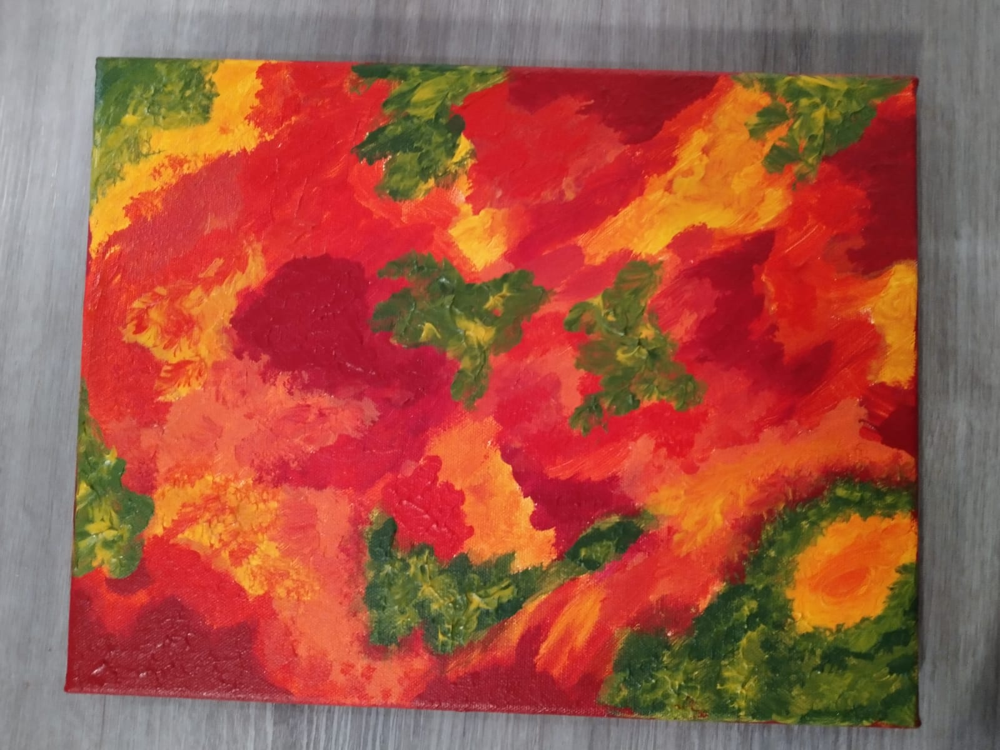
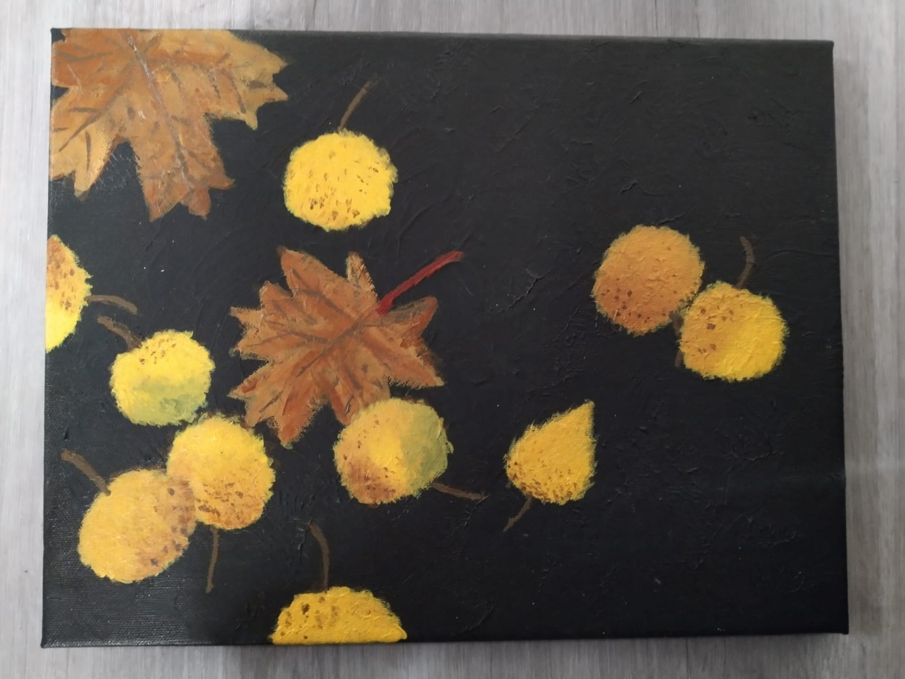

## Projects

### Coding projects

#### Command line tools -course

This webpage is the final project for my command line tools -course.

### Art projects

#### My personal "Picture every day" project

The idea is to take at least one picture of myself every day (or have my picture taken) to raise confidence, since I usually don't like being in pictures.

#### Painting

I've started painting recently, the theme has been fall.

